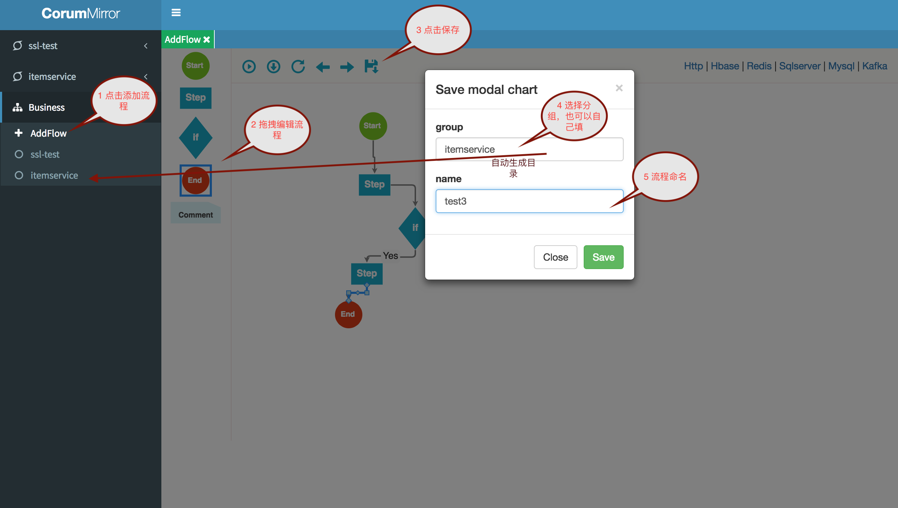
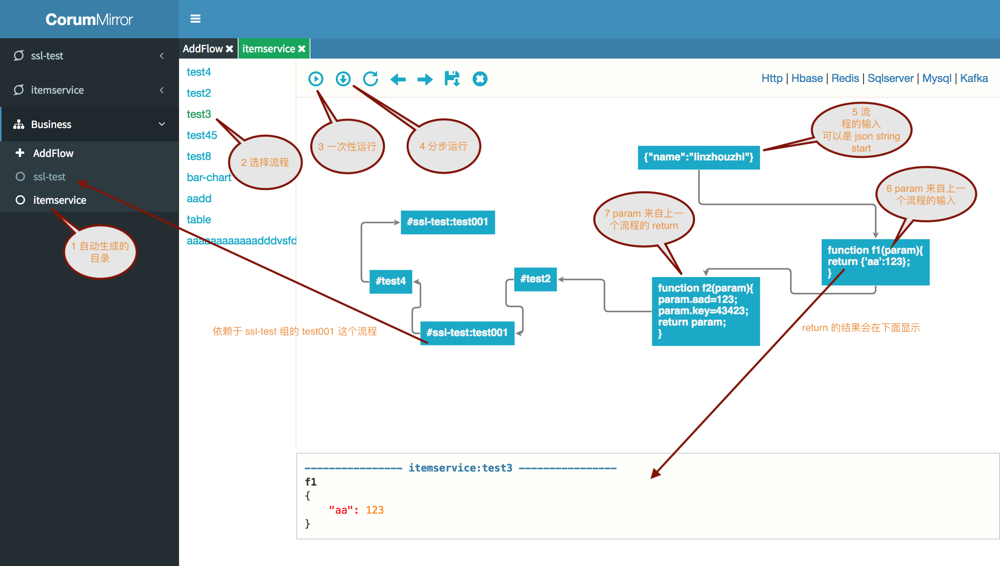
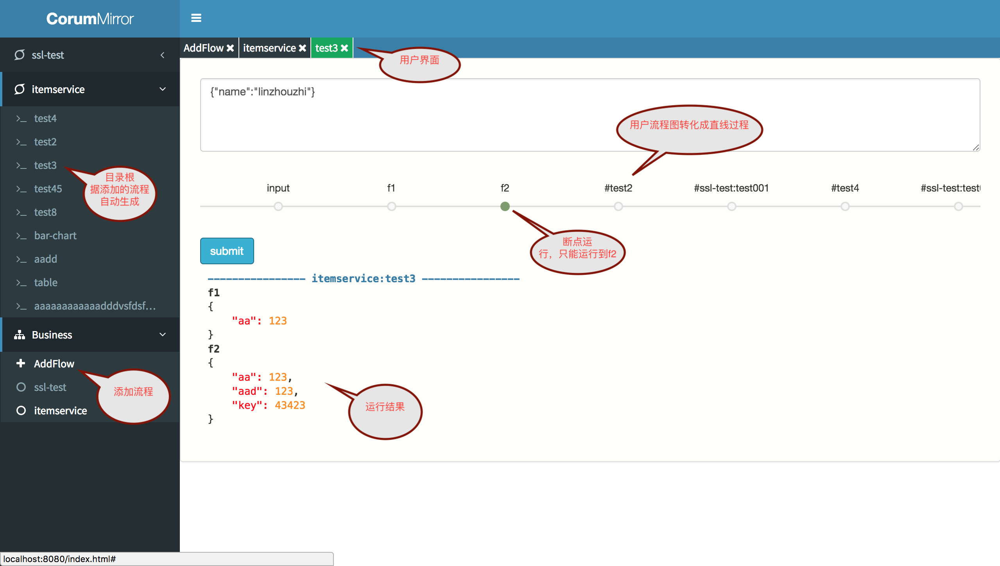

# corumMirror
> 一站式的查询平台昆仑镜（可以定制各种组件， http, kafka, hbase, redis, mysql...,组件之间可以关联查询）

## 一、简介
> corumMirror 采用流程管理的方式来定制查询规则，流程管理可以通过界面直接编辑流程图，每个流程可以相互依赖，并且当前流程的
      输入来自上一个流程的输出。
      举个例子，假设现在有这样的业务需求，某个字段 保存到 hbase 然后缓存到来 redis 通过 kfaka 增量进行更新，如果你要查询该字段的处理过程，是不是需要先查
      hbase -> redis -> kafka  这样才可以定位字段的问题，那么 corumMirror 灵活的流程编辑方式支持类似的各种组合查询。也就是 corumMirror 
      是一个可以快速定位问题的平台。

## 二、特性

#### 1 添加流程自动分组生成对应的目录结构，方便用户使用
#### 2 支持流程运行（可以在流程里写 js 代码）
#### 3 流程图支持断点运行
#### 4 流程之间可以相互依赖，这样可以保证组合方式更加灵活 
  

## 三、使用方式
> 使用方式分为三个过程，添加流程 -> 编辑流程 -> 用户使用

#### 1 添加流程
> 添加流程很简单： 点击 add-flow -> 编辑流程 -> 保存

#### 2 编辑流程
> 双击流程就可以直接编辑，如果要调用 java 代码可以直接用 ajax 封装

#### 3 用户使用
> 流程保存完成后会自动生成用户界面，用户使用的时候可以不关心背后的处理逻辑
